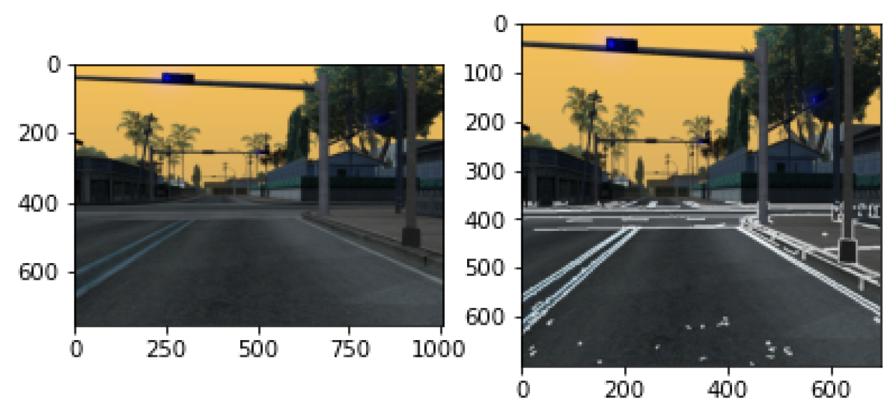

## Self-Driving car for Grand Theft Auto: San Andreas

---

**Important Links**

- Youtube: https://youtu.be/om3HvgN1s00

- Kaggle Dataset Used for training:
    1. https://www.kaggle.com/yogendrayatnalkar/gtasanandreas-drivingtiny
    2. https://www.kaggle.com/yogendrayatnalkar/gta-san-andreas-medium-size

- Kaggle Kernel where model was trained: https://www.kaggle.com/yogendrayatnalkar/fork-of-self-driving-starter

(Please show some love on Github, Youtube and Kaggle if you liked this project)

---
### Model Training, Dataset collection and other details:

- I ran the game in window-mode (i.e not in full-screen) and wrote a program to capture my input key and its corresponding frame as a part of data collection. 
- Made various modifications on dataset capture module such that:
    1. It will only capture frames and key-strokes when the key belongs to any of the training class.
    2. Trigger to stop collecting when game freezes or I am into some part of game which I dont want to record (because condition of data can change the CNN learnings)
    3. Stop recording after few frames if steps are repetitive (exmple: Car will be more on "w" press than "s" press and reverse is not taken very often while driving even in games. Hence, the program automatically stopped recording after few frames).... (and few more features)
- **I only collected 3317 image (due to lack of time)**
- All the images belonged to 8 different classes **(forward, forward right, forward left, backward, backward right, backward left, left, right)**
- The dataset stored locally was uploaded as Kaggle datasets. (Links above)
- I used kaggle kernel for **training and fine-tuned an EfficientNet-B1** on the kaggle dataset.(More information can be gained from Kaggle kernel - link above)
- The CNN is running much better than I had thought on the small numeber of images I had used. 

### On a further note:
- There is a good scope of improvement in this fun project starting from:
    1. Collecting more data and its very easy because I already have the code-base ready.
    2. Checking more types of CNN architectures. Different image processing techniques.
    3. Extra-training of CNN model.
    4. ### **Combining CNN + RNN or Multi-Task Learning** (Lets see)

---

**Installation:**
1. Git clone this repository
2. Run the following command:
> pip install -r requirements.txt
3. Download the model and start using the project within your game (see further instrctions below)

---

**How to use this model:**
1. Download the model from above kaggle kernel (https://www.kaggle.com/yogendrayatnalkar/fork-of-self-driving-starter) and save it in the ./src/models/ folder. 
2. Rename the model to: val_model_medium.h5
3. Start GTA San Andreas in window mode (i.e not in full screen)
    **-- Note: to start the game in window mode you will need "d3d9.dll" file to be in the installation folder of the game. I have attached the required dll in this repository itself.**
4. Open command prompt and inside src folder. (Make sure the requirements.txt is installed)
5. Run the command:- 
> **python play.py**
6. Follow the insturctions on the command prompt now.

> **Note: If your hardware is not able to run this easily then please change the "fame_skipper" variable in "play.py". It will not predict a CNN output on every video frame of the game.**

--- 

### Unique pre-processing 

**I edge-highlighted the bottom half of every frame as pre-processing step. It taught the CNN to focus more on bottom image than the sky. It gave a small bump on accuracy of the model.**

